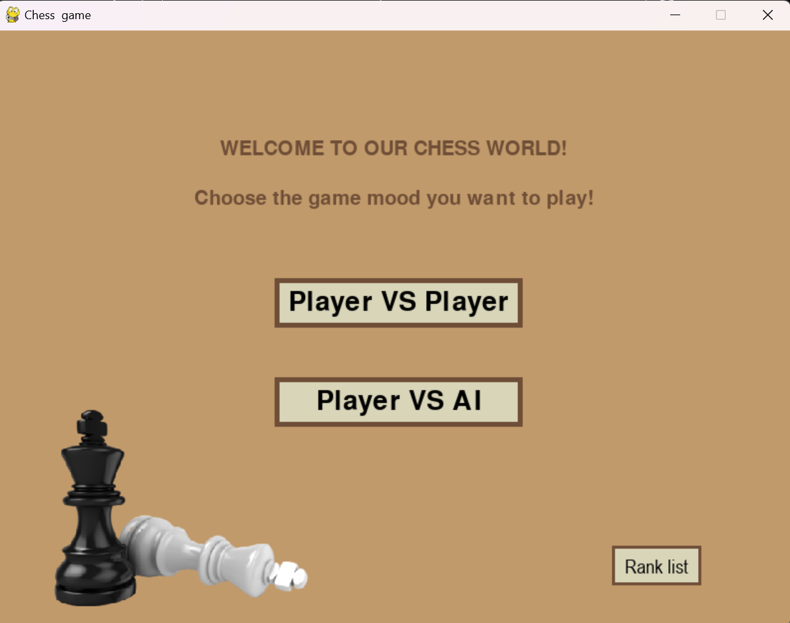
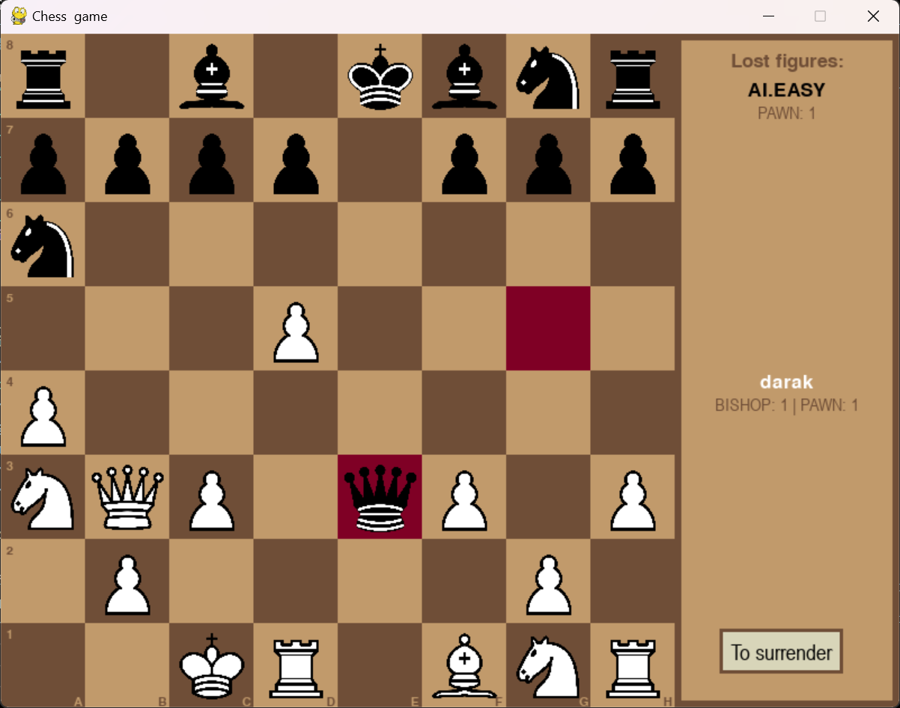
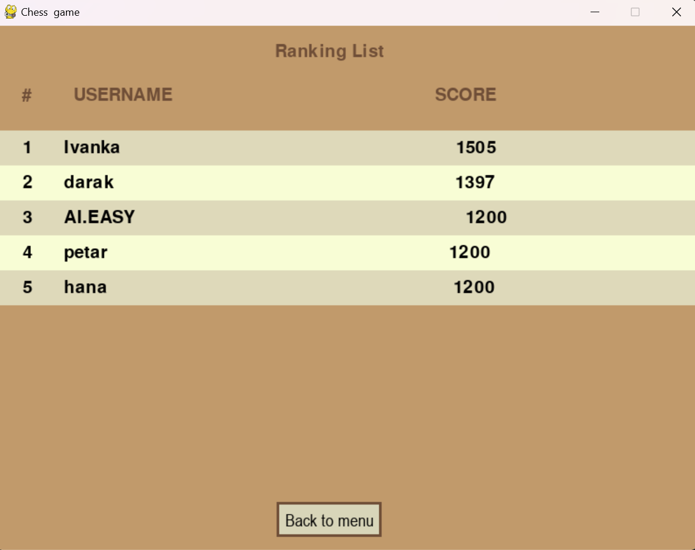
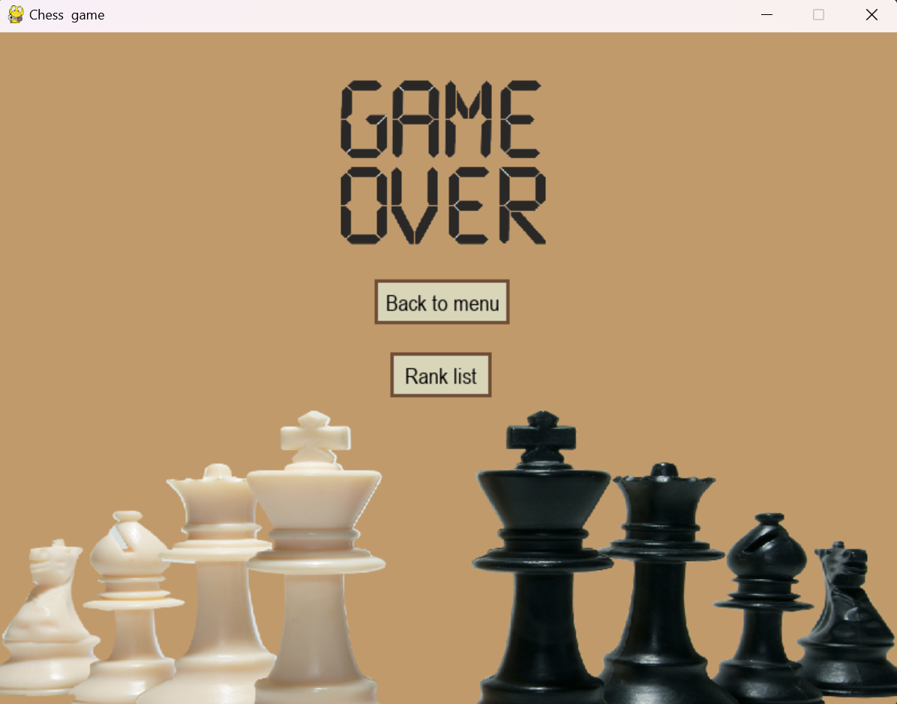

# Chess Game with AI

## About the Project
This is a chess game developed using `pygame` that supports both `Player vs Player` and `Player vs AI` modes. The AI utilizes the `Minimax` algorithm to make intelligent moves, creating a challenging gameplay experience.

The game also features an **ELO ranking system**, allowing players to track their progress and compete for higher ratings based on their performance.


## Requirements
Before running the project, you need to install the required dependencies. The only external library required is `pygame`, and the exact version needed is listed in `requirements.txt`.

### Installation
1. **Clone the repository:**
   ```sh
   git clone https://github.com/darak-gif/chess-ai-game
   cd chess-ai-game
   ```
2. **Install dependencies:**
   ```sh
   pip install -r requirements.txt
   ```

## Running the Game
To start the game, simply run the `main.py` file:
```sh
python main.py
```

## Features
- **Two game modes:**
  - `Player vs Player`
  - `Player vs AI`
- **AI using Minimax Algorithm**
- **Move validation**
- **En passant, castling, and promotion rules implemented**
- **User-friendly interface with `pygame`**

## Screenshots

Here are some screenshots from the game:

### Main Menu


### Gameplay


### Ranglist


### Game Over


## Project Structure
- `main.py` - The entry point of the game
- `src/` - Contains the sourse code
- `screen_states/` - Contains different game states, representing various screens of the game
- `game/` - Contains core game logic
- `ai/` - Implements AI with the Minimax algorithm
- `images/` - Stores images for the game
- `sounds/` - Stores sounds for the game
- `ranglist.txt` - Data of the users
- `requirements.txt` - Lists required dependencies

## License
This project is open-source. Feel free to modify and improve it!
